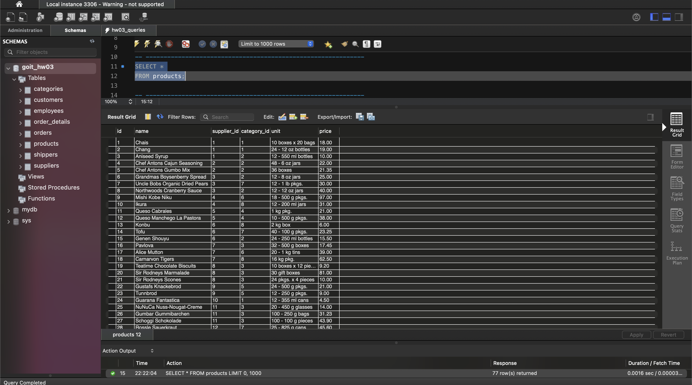
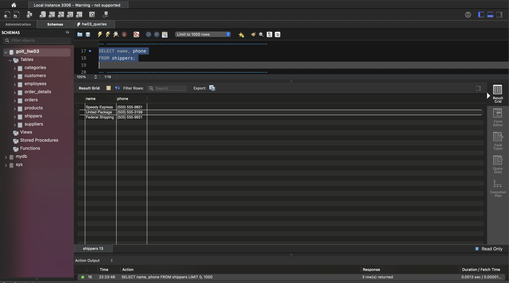
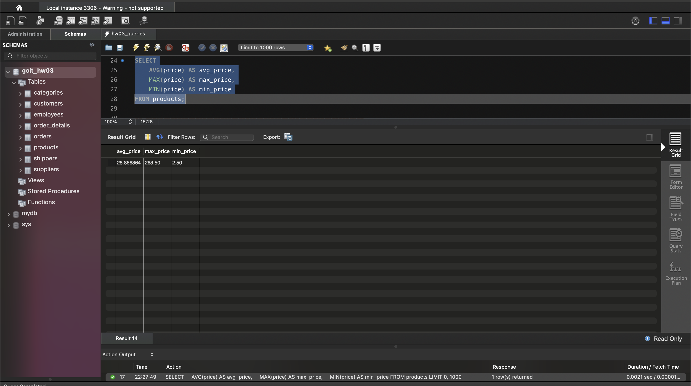
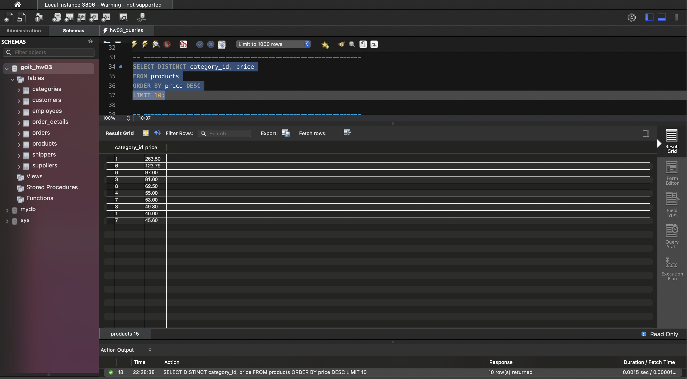
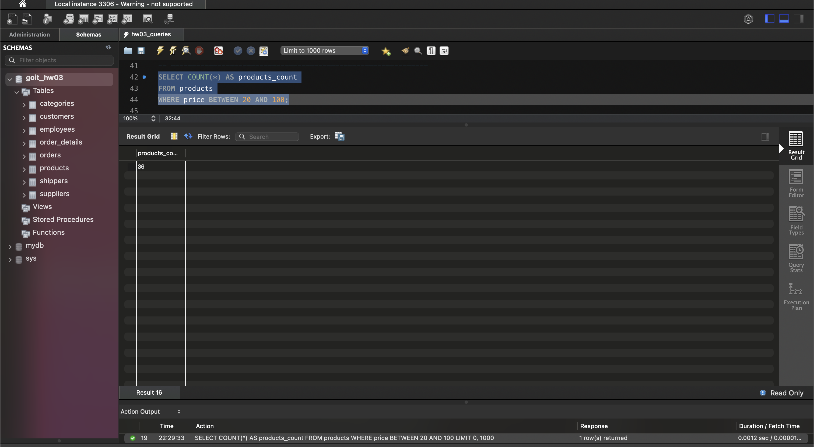
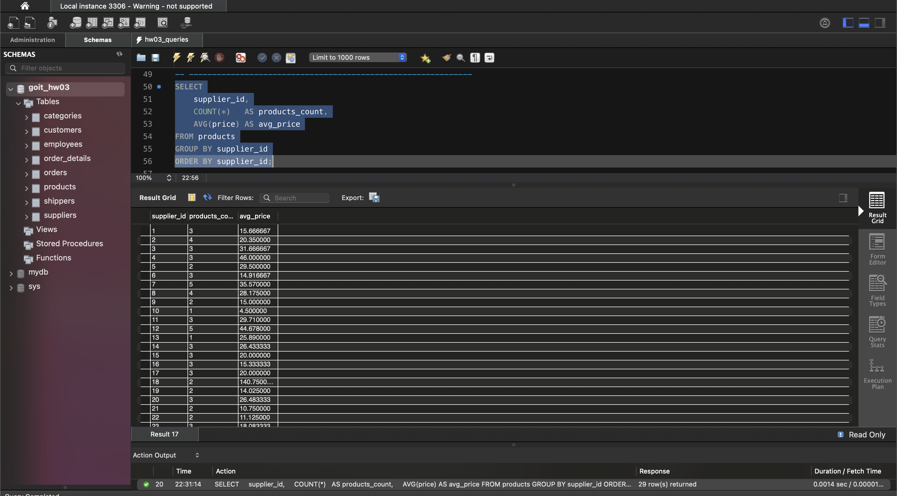

# Домашнє завдання до Теми 3. Мова SQL. Запити до даних

У цьому домашньому завданні вам необхідно застосувати свої знання для отримання конкретної інформації із завантаженого раніше (у конспекті до теми 3) датасету, а саме написати кілька SQL команд — запитів до даних.

### Підготовка та завантаження домашнього завдання

1. Створіть публічний репозиторій `goit-rdb-hw-03`.
2. Якщо раніше ви не завантажували цей архів з даними у форматі "csv", зробіть це зараз.
3. Виконайте завдання та відправте у свій репозиторій скриншоти запитів і результатів, а також текст SQL коду в текстовому файлі.
4. Завантажте скриншоти і текстовий файл на свій комп'ютер та прикріпіть їх в LMS архівом. Назва архіву повинна бути у форматі ДЗ3_ПІБ.
5. Прикріпіть посилання на репозиторій `goit-rdb-hw-03` та відправте на перевірку.

💡 **ВАЖЛИВО.** Будь ласка, пронумеровуйте скріншоти, щоб менторам було зрозуміло, до якого етапу ДЗ відноситься кожний з них. Наприклад, якщо файл відноситься до пункту 3, то назва файла має починатися так: `p3_`.

### Формат здачі

- Прикріплені файли репозиторію архівом із назвою ДЗ3_ПІБ.
- Посилання на репозиторій.

## Опис домашнього завдання

1. Напишіть SQL команду, за допомогою якої можна:
   - вибрати всі стовпчики (за допомогою wildcard `*`) з таблиці `products`;
   - вибрати тільки стовпчики `name`, `phone` з таблиці `shippers`,

   та перевірте правильність її виконання в MySQL Workbench.

2. Напишіть SQL команду, за допомогою якої можна знайти середнє, максимальне та мінімальне значення стовпчика `price` таблички `products`, та перевірте правильність її виконання в MySQL Workbench.

3. Напишіть SQL команду, за допомогою якої можна обрати унікальні значення колонок `category_id` та `price` таблиці `products`. Оберіть порядок виведення на екран за спаданням значення `price` та виберіть тільки 10 рядків. Перевірте правильність виконання команди в MySQL Workbench.

4. Напишіть SQL команду, за допомогою якої можна знайти кількість продуктів (рядків), які знаходиться в цінових межах від 20 до 100, та перевірте правильність її виконання в MySQL Workbench.

5. Напишіть SQL команду, за допомогою якої можна знайти кількість продуктів (рядків) та середню ціну (`price`) у кожного постачальника (`supplier_id`), та перевірте правильність її виконання в MySQL Workbench.

## Критерії прийняття

1. Прикріплені посилання на репозиторій `goit-rdb-hw-03` та безпосередньо самі файли репозиторію архівом.
2. Написано всі 6 команд. SQL команди виконуються й повертають необхідні дані.

---

## Результат виконаного ДЗ

Усі запити — у файлі [hw03_queries.sql](./hw03_queries.sql). Датасет імпортовано у схему `goit_hw03` MySQL.

### Пункт 1. Вибірка стовпчиків

**1.1. Усі стовпчики таблиці `products`**

```sql
SELECT *
FROM products;
```

Результат: 77 рядків, 6 стовпчиків (`id`, `name`, `supplier_id`, `category_id`, `unit`, `price`).



**1.2. Тільки `name` та `phone` з таблиці `shippers`**

```sql
SELECT name, phone
FROM shippers;
```

| name | phone |
|---|---|
| Speedy Express | (503) 555-9831 |
| United Package | (503) 555-3199 |
| Federal Shipping | (503) 555-9931 |



### Пункт 2. Середнє, максимальне та мінімальне значення `price`

```sql
SELECT
    AVG(price) AS avg_price,
    MAX(price) AS max_price,
    MIN(price) AS min_price
FROM products;
```

| avg_price | max_price | min_price |
|---|---|---|
| 28.866364 | 263.50 | 2.50 |



### Пункт 3. Унікальні пари `category_id` та `price`, за спаданням `price`, 10 рядків

```sql
SELECT DISTINCT category_id, price
FROM products
ORDER BY price DESC
LIMIT 10;
```

| category_id | price |
|---|---|
| 1 | 263.50 |
| 6 | 123.79 |
| 6 | 97.00 |
| 3 | 81.00 |
| 8 | 62.50 |
| 4 | 55.00 |
| 7 | 53.00 |
| 3 | 49.30 |
| 1 | 46.00 |
| 7 | 45.60 |



### Пункт 4. Кількість продуктів з ціною від 20 до 100

```sql
SELECT COUNT(*) AS products_count
FROM products
WHERE price BETWEEN 20 AND 100;
```

| products_count |
|---|
| 36 |



### Пункт 5. Кількість продуктів та середня ціна у кожного постачальника

```sql
SELECT
    supplier_id,
    COUNT(*)   AS products_count,
    AVG(price) AS avg_price
FROM products
GROUP BY supplier_id
ORDER BY supplier_id;
```

Результат: 29 рядків — по одному на кожного постачальника. Перші рядки:

| supplier_id | products_count | avg_price |
|---|---|---|
| 1 | 3 | 15.666667 |
| 2 | 4 | 20.350000 |
| 3 | 3 | 31.666667 |
| 4 | 3 | 46.000000 |
| 5 | 2 | 29.500000 |
| ... | ... | ... |



## Структура репозиторію

| Файл | Опис |
|---|---|
| `hw03_queries.sql` | текст усіх 6 SQL-команд (пункти 1–5) |
| `images/p1_1_products_all.png` | п. 1.1 — `SELECT * FROM products` |
| `images/p1_2_shippers_name_phone.png` | п. 1.2 — `name`, `phone` з `shippers` |
| `images/p2_price_avg_max_min.png` | п. 2 — AVG / MAX / MIN `price` |
| `images/p3_distinct_category_price_top10.png` | п. 3 — DISTINCT, ORDER BY DESC, LIMIT 10 |
| `images/p4_count_price_20_100.png` | п. 4 — COUNT з BETWEEN 20 AND 100 |
| `images/p5_count_avg_by_supplier.png` | п. 5 — COUNT та AVG з GROUP BY `supplier_id` |
